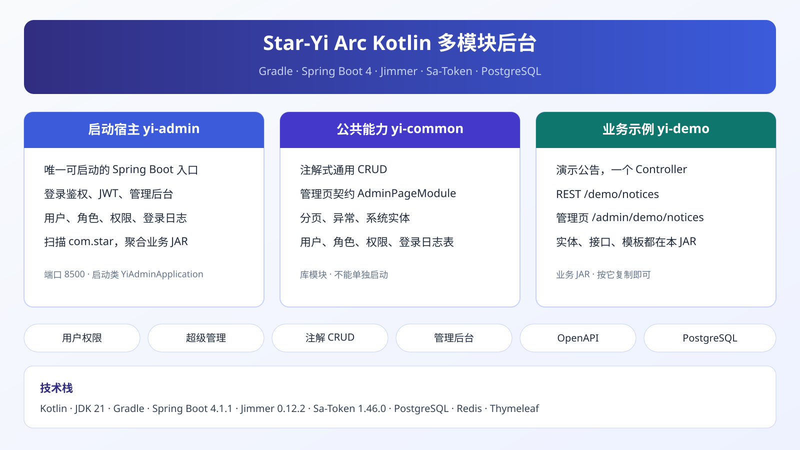
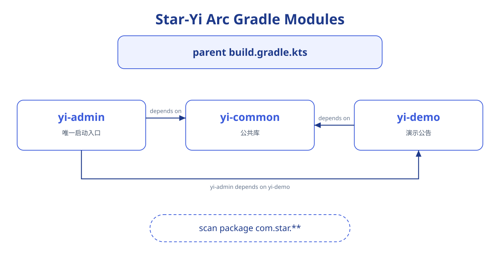
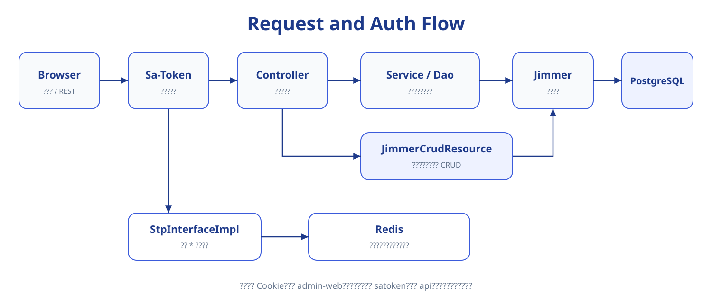

<h1 align="center">Star-Yi Arc</h1>

<p align="center">
  <strong>Kotlin 版模块化后台</strong> · 与 Java 版 <a href="https://github.com/Star-yb/Star-Yi">Star-Yi</a> 并列，通用增删改查收成一个 Controller，管理页按路径高亮，默认数据库是 MySQL
</p>

<p align="center">
  
  
  
  
  
  
</p>



| 项 | 值 |
|----|-----|
| 语言 | Kotlin，JDK **21** |
| 构建 | Gradle|
| 框架 | Spring Boot **4.1.1** |
| ORM | Jimmer **0.12.2**（KSP） |
| 鉴权 | Sa-Token **1.46.0**（JWT） |
| 数据库 | MySQL（默认）。`sql/pgsql.sql` 可切换 |
| 缓存 | Redis |
| 管理端 | Thymeleaf SSR（`/admin/**`） |
| 接口文档 | springdoc-openapi / Swagger UI |

---

## 功能

- **认证**：账号登录 / 登出 / token 校验。接口走请求头 `satoken`，管理页走 Cookie，两套会话互不影响
- **RBAC**：用户、角色、权限仍是手写分层。`StpInterfaceImpl` 注入角色与权限，普通账号缓存在 Redis
- **超级管理员后台**：用户、角色、权限、登录日志、接口文档。当前页按路径匹配菜单
- **通用 CRUD**：`yi-common` 提供 `JimmerCrudResource` 和注解。演示公告按 `yi-demo` 复制即可，不再套 Controller、Service、Repository、Dao 四层
- **管理页 SPI**：业务 JAR 自己登记侧栏菜单和模板，不必改 `fragments.html`
- **OpenAPI**：启动 `yi-admin` 后扫描 `com.star`，业务模块只写注解

---

## 和 Java 版的差别

Java 版 Star-Yi 仍是对照本。Arc 沿用同一套模块边界，下面这些是这次重做时定下来的。

| 方面 | Arc |
|------|-----|
| 语言和构建 | Kotlin、Gradle、Jimmer KSP。没有 Lombok |
| 数据库 | 与 Java 版相同：默认 MySQL，另有 `sql/pgsql.sql` |
| 通用 CRUD | 一个 Controller 加上注解 |
| 管理页 | 当前页按路径匹配菜单，模板不再手写高亮键 |
| 建库脚本 | `sql/mysql.sql` 按结构、角色权限、超级管理员、普通用户分段，公告表在最后 |

---

## 模块



```text
Star-Yi-Arc/                父工程：版本、KSP、Jimmer
├── yi-admin/               启动入口（com.star.YiAdminApplication）
├── yi-common/              公共能力：异常、分页、CRUD、管理页契约、系统实体
├── yi-demo/                注解 CRUD + 管理页示例（演示公告）
├── sql/mysql.sql           默认建库脚本（MySQL），末尾是演示公告表
├── sql/pgsql.sql           PostgreSQL 脚本，改连接后可切换
└── docs/                   专题文档
```

| 模块 | 职责 | 是否独立启动 |
|------|------|----------------|
| `yi-admin` | 启动、鉴权、系统管理、OpenAPI、聚合业务 JAR | 是 |
| `yi-common` | 被其它模块依赖的库 | 否 |
| `yi-demo` | 示例业务 JAR，由 `yi-admin` 依赖后扫描生效 | 否 |

启动类扫描 `com.star`。业务代码必须放在这个前缀下。

父工程把 Kotlin、Spring Boot 依赖清单、KSP 和 Jimmer 交给每个子模块。`spring-boot-starter-web` 也在父工程，库模块才能编译 Controller。嵌入式服务器只在 `yi-admin` 里运行。Thymeleaf 只放在 `yi-admin`。

可运行配置只在 `yi-admin/src/main/resources/application.properties`。库模块不要再放一份同名文件。

各模块源码清单见 `yi-admin/README.md` 和 `yi-common/README.md`。

---

## 环境要求

- JDK **21**
- 本机已安装的 `gradle`（仓库里没有 Wrapper）
- MySQL 8（库名、地址与 `application.properties` 一致，默认库 `star_yi`）
- Redis（本机 `6379`，库号见配置）

Kotlin 实体和 DTO 由 KSP 生成。没编译就打开生成类型时，IDE 会报找不到类。先执行：

```bash
gradle :yi-admin:compileKotlin
```

---

## 快速开始

### 1. 建库

默认数据库是 MySQL。创建数据库后执行：

```text
sql/mysql.sql
```

脚本按四段排列。执行到哪一段，库里就只有到那一段为止的内容。

| 停在 | 得到 |
|------|------|
| 1. 结构 | 系统空表 |
| 2. 角色与权限 | 三个角色、权限树、角色和权限的关联 |
| 3. 超级管理员 | 账号 `admin`，密码 `123456` |
| 4. 普通用户 | `user1`、`user2`、`user3`，密码同样是 `123456` |

演示公告表 `demo_notice` 在脚本最后。要用 `yi-demo` 时再执行这一段。

`jimmer.database-validation-mode` 是 `ERROR`。表或列和实体不一致时，进程起不来。

改用 PostgreSQL 时，执行 `sql/pgsql.sql`，并把 `application.properties` 里的数据源和 `jimmer.dialect` 换成 PostgreSQL。两份脚本的表和数据相同，差别只在字段类型。MySQL 和 PostgreSQL 的驱动都已经带上。

### 2. 配置

编辑 `yi-admin/src/main/resources/application.properties`：

- `spring.datasource.*`：库地址、账号、密码
- Redis 地址、库号与密码
- `sa-token.jwt-secret-key`：生产环境务必替换

### 3. 启动

```bash
gradle :yi-admin:bootRun
```

| 用途 | 地址 |
|------|------|
| 管理登录 | http://localhost:8500/admin/login |
| 用户管理 | http://localhost:8500/admin/user |
| 演示公告 | http://localhost:8500/admin/demo/notices |
| Swagger UI | http://localhost:8500/swagger-ui.html |
| OpenAPI JSON | http://localhost:8500/v3/api-docs |

管理页登录用 `admin` / `123456`。接口登录是 `POST /auth/login`。请求头名是 `satoken`，只放 token，不要加 `Bearer`。**不要把演示账号用于生产。**

超级管理员后台要求角色 `*`。这个 `*` 不是表里的 `SUPER_ADMIN`。`Users.superAdmin` 为 `1` 时，`StpInterfaceImpl` 固定返回角色 `*` 和权限 `*`。

---

## 请求链路



```text
HTTP
  → 按路径分流
      /auth、/test、Swagger     免登录
      /admin/**                 登录，并且角色是 *
      其他 REST                 请求头 satoken
  → Controller
      用户 / 角色 / 权限        Service → Dao → Jimmer → MySQL
      注解 CRUD（如演示公告）   JimmerCrudResource → Jimmer → MySQL
```

| 入口 | 会话 | 作用 |
|------|------|------|
| `POST /admin/login` | Cookie，设备 `admin-web` | 后台页面 |
| `POST /auth/login` | 请求头 `satoken`，设备 `api` | 接口 |

退出后台只注销 `admin-web`。`GET /auth/logout` 只注销 `api`。

普通账号只加载状态为 `0` 的角色和权限。角色或权限被禁用后，下一次鉴权就不再带上它们。缓存键由 `SaAuthCache` 维护。用户改角色、角色改权限或权限本身变更时，对应 Service 会清掉相关缓存。

`sql/mysql.sql` 里的权限树是业务权限码，供接口鉴权使用。后台侧栏不读这张表，侧栏来自 `AdminPageModule`。

---

## 后台页面

`/admin/**` 由 `yi-admin` 提供。系统菜单在 `SysAdminPageModule`：用户、角色、权限、登录日志、接口文档。演示公告由 `yi-demo` 登记，分组是「开发演示」。

分组按模块的 `moduleOrder` 出现，组内再按菜单的 `order`。当前页按请求路径和菜单 `path` 做最长匹配。`/admin/role-permission` 高亮「角色管理」，`/admin/permission-list` 高亮「权限管理」。

业务模块在自己的 JAR 里登记菜单，模板放在 `classpath:/admin/`。步骤见 [docs/admin-pages.md](docs/admin-pages.md)。

---

## 新增一个业务模块

1. 新建 Gradle 模块，依赖 `yi-common`。
2. 包名放在 `com.star` 下。
3. 按 [docs/crud.md](docs/crud.md) 写实体、`.dto`，Controller 继承 `JimmerCrudResource`。
4. 按 [docs/admin-pages.md](docs/admin-pages.md) 注册管理页（可选）。
5. 在 `settings.gradle.kts` 加入模块，并在 `yi-admin/build.gradle.kts` 增加依赖，否则不会被扫描。
6. Jimmer `database-validation-mode` 为 `ERROR`：先执行建表 SQL，再启动。

`yi-demo` 是注解 CRUD 的对照实现。用户、角色、权限仍是手写的 Controller、Service、Dao，不要按那三层去套新资源。

---

## 接口

`/auth/**`、`/test/**`、Swagger 和 `/v3/api-docs/**` 不要求登录。其余 REST 要登录。列表页码从 1 开始。没传或小于 1 时按第 1 页。

### 认证

| 方法 | 路径 | 作用 |
|------|------|------|
| POST | `/auth/login` | 登录，返回 token |
| GET | `/auth/logout` | 注销当前 `api` 会话 |
| POST | `/auth/verify` | 校验 token |

### 用户 `/users`

重置密码和导出还要求角色 `*`。

| 方法 | 路径 | 作用 |
|------|------|------|
| GET | `/users` | 分页列表 |
| POST | `/users` | 创建，默认密码 `123456` |
| GET | `/users/{id}` | 详情 |
| PUT | `/users/{id}` | 更新 |
| DELETE | `/users/{id}` | 删除 |
| GET | `/users/myInfo` | 当前登录用户 |
| POST | `/users/changePassword` | 修改自己的密码，请求体是 `oldPassword`、`newPassword` |
| POST | `/users/{id}/enable` | 启用 |
| POST | `/users/{id}/disable` | 禁用，并注销该账号全部已登录会话 |
| GET | `/users/roles/{id}` | 用户的角色 |
| PUT | `/users/{id}/roles` | 改角色 |
| POST | `/users/{id}/resetPassword` | 重置为 `123456` |
| GET | `/users/export` | 导出 xlsx |

### 角色 `/roles`

| 方法 | 路径 | 作用 |
|------|------|------|
| GET | `/roles` | 分页列表 |
| POST | `/roles` | 创建 |
| GET | `/roles/{id}` | 详情 |
| PUT | `/roles/{id}` | 更新 |
| DELETE | `/roles/{id}` | 删除 |
| POST | `/roles/{id}/enable` | 启用 |
| POST | `/roles/{id}/disable` | 禁用 |
| PUT | `/roles/{id}/permission` | 改这个角色的权限 |
| GET | `/roles/user/{userId}` | 某用户的角色 |

### 权限 `/permissions`

更新是动态的：没提交的字段保持原值。

| 方法 | 路径 | 作用 |
|------|------|------|
| GET | `/permissions` | 分页列表 |
| GET | `/permissions/tree` | 分页树 |
| POST | `/permissions` | 创建 |
| GET | `/permissions/{id}` | 详情 |
| PUT | `/permissions/{id}` | 更新 |
| DELETE | `/permissions/{id}` | 删除 |
| POST | `/permissions/{id}/enable` | 启用 |
| POST | `/permissions/{id}/disable` | 禁用 |
| GET | `/permissions/role/{roleId}` | 某角色已有的权限 |
| GET | `/permissions/parent/{parentId}` | 子权限 |

### 演示公告 `/demo/notices`

五条基础接口由 `@CrudAll` 开放。详情做了覆盖，调用时控制台会打印这方法已被重构。

| 方法 | 路径 | 作用 |
|------|------|------|
| GET | `/demo/notices` | 分页列表 |
| POST | `/demo/notices` | 创建 |
| GET | `/demo/notices/{id}` | 详情 |
| PUT | `/demo/notices/{id}` | 更新 |
| DELETE | `/demo/notices/{id}` | 删除 |
| GET | `/demo/notices/pinned` | 当前置顶的公告 |
| PUT | `/demo/notices/{id}/pin` | 设置是否置顶，请求体是 `{ "pinned": true }` |

`GET /test/users` 和 `GET /test/users/{id}` 免登录，只用于对照查询。

---

## 文档

专题文档放在 [`docs/`](docs/README.md)，文件名 **kebab-case 英文**。配图放在 `docs/assets/`。

| 文档 | 内容 |
|------|------|
| [docs/README.md](docs/README.md) | 文档目录与命名 |
| [docs/architecture.md](docs/architecture.md) | 模块边界、请求分层、代码放在哪 |
| [docs/crud.md](docs/crud.md) | 通用 CRUD |
| [docs/admin-pages.md](docs/admin-pages.md) | 管理页 SPI |

---

## 安全提示

当前仓库的 `application.properties` 含本地开发默认值（数据源地址和密码、Redis、JWT 密钥）。开源或部署生产时请：

1. 使用环境变量或单独的生产配置覆盖密钥，不要提交真实密码。
2. 更换 JWT 密钥。
3. 修改种子用户密码。
4. 生产环境收紧跨域。当前示例不要直接用于生产。

---

## 许可证

尚未指定开源许可证。需要对外授权时，请选择并添加 `LICENSE` 文件（例如 Apache-2.0 或 MIT），并在本 README 底部写明许可证名称。
