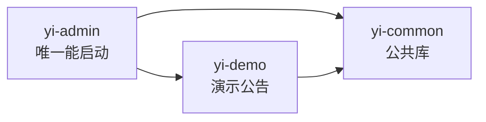
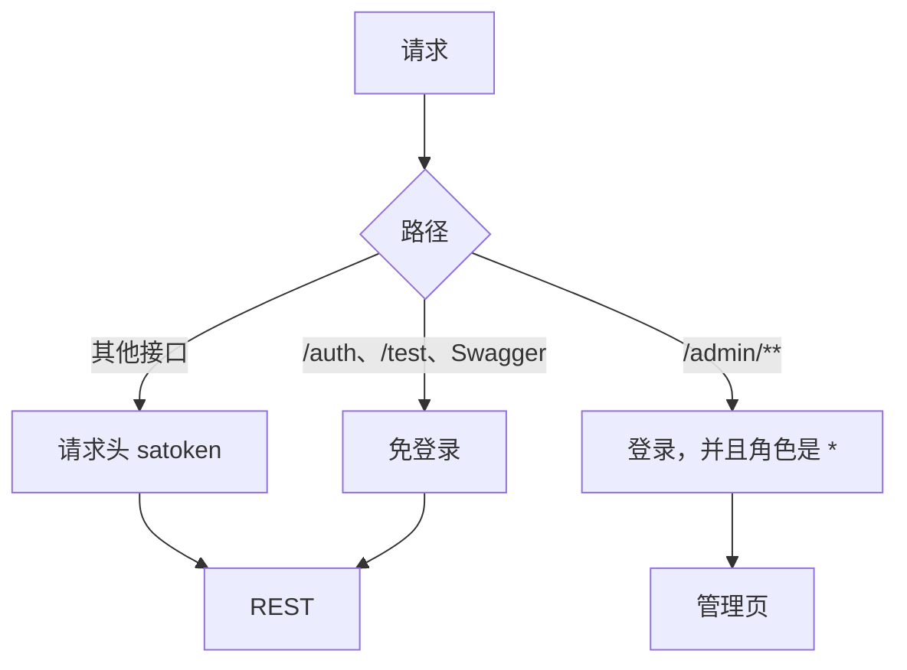

# Star-Yi Arc

Gradle 多模块后台。它和 Java 版 Star-Yi 是并列的另一版：语言改成 Kotlin，通用增删改查收成一个 Controller，管理页按路径高亮，数据库用 PostgreSQL。


| 项    | 值                        |
| ---- | ------------------------ |
| 语言   | Kotlin，JDK 21            |
| 构建   | 本机 Gradle，仓库里没有 Wrapper  |
| 框架   | Spring Boot 4.1.1        |
| ORM  | Jimmer 0.12.2，KSP        |
| 鉴权   | Sa-Token 1.46.0，JWT      |
| 数据库  | PostgreSQL               |
| 缓存   | Redis                    |
| 管理端  | Thymeleaf，路径 `/admin/**` |
| 接口文档 | springdoc，Swagger UI     |


各模块源码清单在 `yi-admin/README.md` 和 `yi-common/README.md`。模块边界见 [docs/architecture.md](docs/architecture.md)。管理页和通用 CRUD 的接法见 [docs/admin-pages.md](docs/admin-pages.md)、[docs/crud.md](docs/crud.md)。

## 和 Java 版的差别

Java 版 Star-Yi 仍是对照本。Arc 沿用同一套模块边界，下面这些是这次重做时定下来的：

| 方面 | Arc |
|------|-----|
| 语言和构建 | Kotlin、Gradle、Jimmer KSP。没有 Lombok |
| 数据库 | PostgreSQL。MySQL 脚本留在 `sql/mysql.sql` |
| 通用 CRUD | 一个 Controller 加上注解，不再套 Controller、Service、Repository、Dao 四层 |
| 管理页 | 当前页按路径匹配菜单。模板不再手写高亮键 |
| 建库脚本 | `sql/sql.sql` 按结构、角色权限、超级管理员、普通用户分段，公告表在最后 |

用户、角色、权限仍是手写分层。演示公告用来看通用 CRUD 和管理页扩展。

## 模块




| 模块          | 职责                       | 能否单独启动 |
| ----------- | ------------------------ | ------ |
| `yi-admin`  | 启动、鉴权、系统管理页面和接口、OpenAPI  | 能      |
| `yi-common` | 系统实体、异常、分页、通用 CRUD、管理页契约 | 不能     |
| `yi-demo`   | 演示公告。接口、实体和管理页都在这个 JAR 里 | 不能     |


启动类是 `com.star.YiAdminApplication`，扫描 `com.star`。业务代码必须放在这个前缀下。

父工程把 Kotlin、Spring Boot 依赖清单、KSP 和 Jimmer 交给每个子模块。`spring-boot-starter-web` 也在父工程，库模块才能编译 Controller。嵌入式服务器只在 `yi-admin` 里运行。Thymeleaf 只放在 `yi-admin`。

```text
Star-Yi-Arc/
├── build.gradle.kts
├── settings.gradle.kts
├── README.md
├── docs/                 架构、管理页用法、通用 CRUD 用法
├── sql/sql.sql           PostgreSQL，当前使用
├── sql/mysql.sql         保留的 MySQL 脚本
├── yi-admin/             唯一启动入口
├── yi-common/            公共库
└── yi-demo/              演示公告
```

可运行配置只在 `yi-admin/src/main/resources/application.properties`。库模块不要再放一份同名文件。

## 环境


| 软件         | 要求                               |
| ---------- | -------------------------------- |
| JDK        | 21                               |
| Gradle     | 本机已安装的 `gradle`                  |
| PostgreSQL | 与 `application.properties` 里的库一致 |
| Redis      | 本机 6379，库号见配置                    |


Kotlin 实体和 DTO 由 KSP 生成。没编译就打开生成类型时，IDE 会报找不到类。先执行：

```text
gradle :yi-admin:compileKotlin
```


## 数据库

建好配置里的 PostgreSQL 库，再执行 `sql/sql.sql`。脚本按四段排列，执行到哪一段，库里就只有到那一段为止的内容。


| 停在       | 得到                                     |
| -------- | -------------------------------------- |
| 1. 结构    | 系统空表                                   |
| 2. 角色与权限 | 三个角色、权限树、角色和权限的关联                      |
| 3. 超级管理员 | 账号 `admin`，密码 `123456`                 |
| 4. 普通用户  | `user1`、`user2`、`user3`，密码同样是 `123456` |


演示公告表 `demo_notice` 在脚本最后。要用 `yi-demo` 时再执行这一段。

`jimmer.database-validation-mode` 是 `ERROR`。表或列和实体不一致时，进程起不来。

`sql/mysql.sql` 是保留的 MySQL 脚本，分段方式相同。当前工程连的是 PostgreSQL。

## 启动

```text
gradle :yi-admin:bootRun
```


| 用途           | 地址                                                                                   |
| ------------ | ------------------------------------------------------------------------------------ |
| 管理登录         | [http://localhost:8500/admin/login](http://localhost:8500/admin/login)               |
| 用户管理         | [http://localhost:8500/admin/user](http://localhost:8500/admin/user)                 |
| 演示公告         | [http://localhost:8500/admin/demo/notices](http://localhost:8500/admin/demo/notices) |
| Swagger UI   | [http://localhost:8500/swagger-ui.html](http://localhost:8500/swagger-ui.html)       |
| OpenAPI JSON | [http://localhost:8500/v3/api-docs](http://localhost:8500/v3/api-docs)               |


管理页登录用 `admin` / `123456`。接口登录是 `POST /auth/login`。请求头名是 `satoken`，只放 token，不要加 `Bearer` 。

## 登录和权限

请求进到 `yi-admin` 之后，按路径分成三条：



后台和接口是两套会话，互不影响。


| 入口                  | 会话                     | 作用   |
| ------------------- | ---------------------- | ---- |
| `POST /admin/login` | Cookie，设备 `admin-web`  | 后台页面 |
| `POST /auth/login`  | 请求头 `satoken`，设备 `api` | 接口   |


退出后台只注销 `admin-web`。`GET /auth/logout` 只注销 `api`。

`/admin/**` 要求角色 `*`。这个 `*` 不是表里的 `SUPER_ADMIN`。`Users.superAdmin` 为 `1` 时，`StpInterfaceImpl` 固定返回角色 `*` 和权限 `*`，并且每次鉴权都会先查用户行。种子账号 `admin` 就是这样。

普通账号只加载状态为 `0` 的角色和权限。角色或权限被禁用后，下一次鉴权就不再带上它们。普通账号的角色和权限缓存在 Redis，键由 `SaAuthCache` 维护。用户改角色、角色改权限或权限本身变更时，对应 Service 会清掉相关缓存。

`sql/sql.sql` 里的权限树是业务权限码，供接口鉴权使用。后台侧栏不读这张表，侧栏来自 `AdminPageModule`。

## 后台页面

`/admin/**` 由 `yi-admin` 提供。系统菜单在 `SysAdminPageModule`：用户、角色、权限、登录日志、接口文档。演示公告由 `yi-demo` 登记，分组是「开发演示」。

分组按模块的 `moduleOrder` 出现，组内再按菜单的 `order`。当前页按请求路径和菜单 `path` 做最长匹配，模板不用再写菜单键。`/admin/role-permission` 高亮「角色管理」，`/admin/permission-list` 高亮「权限管理」。

业务模块在自己的 JAR 里登记菜单，模板放在 `classpath:/admin/`。具体步骤见 [docs/admin-pages.md](docs/admin-pages.md)。

## 两种接口

用户、角色、权限是手写的 Controller、Service、Dao。演示公告不走这三层，Controller 继承 `JimmerCrudResource`，用注解决定开放哪几条基础接口。具体步骤见 [docs/crud.md](docs/crud.md)。

`/auth/**`、`/test/**`、Swagger 和 `/v3/api-docs/**` 不要求登录。其余 REST 要登录。

### 认证


| 方法   | 路径             | 作用            |
| ---- | -------------- | ------------- |
| POST | `/auth/login`  | 登录，返回 token   |
| GET  | `/auth/logout` | 注销当前 `api` 会话 |
| POST | `/auth/verify` | 校验 token      |


### 用户 `/users`

重置密码和导出还要求角色 `*`。


| 方法     | 路径                          | 作用                                       |
| ------ | --------------------------- | ---------------------------------------- |
| GET    | `/users`                    | 分页列表                                     |
| POST   | `/users`                    | 创建，默认密码 `123456`                         |
| GET    | `/users/{id}`               | 详情                                       |
| PUT    | `/users/{id}`               | 更新                                       |
| DELETE | `/users/{id}`               | 删除                                       |
| GET    | `/users/myInfo`             | 当前登录用户                                   |
| POST   | `/users/changePassword`     | 修改自己的密码，请求体是 `oldPassword`、`newPassword` |
| POST   | `/users/{id}/enable`        | 启用                                       |
| POST   | `/users/{id}/disable`       | 禁用                                       |
| GET    | `/users/roles/{id}`         | 用户的角色                                    |
| PUT    | `/users/{id}/roles`         | 改角色                                      |
| POST   | `/users/{id}/resetPassword` | 重置为 `123456`                             |
| GET    | `/users/export`             | 导出 xlsx                                  |


### 角色 `/roles`


| 方法     | 路径                       | 作用       |
| ------ | ------------------------ | -------- |
| GET    | `/roles`                 | 分页列表     |
| POST   | `/roles`                 | 创建       |
| GET    | `/roles/{id}`            | 详情       |
| PUT    | `/roles/{id}`            | 更新       |
| DELETE | `/roles/{id}`            | 删除       |
| POST   | `/roles/{id}/enable`     | 启用       |
| POST   | `/roles/{id}/disable`    | 禁用       |
| PUT    | `/roles/{id}/permission` | 改这个角色的权限 |
| GET    | `/roles/user/{userId}`   | 某用户的角色   |


### 权限 `/permissions`

更新是动态的：没提交的字段保持原值。


| 方法     | 路径                               | 作用       |
| ------ | -------------------------------- | -------- |
| GET    | `/permissions`                   | 分页列表     |
| GET    | `/permissions/tree`              | 分页树      |
| POST   | `/permissions`                   | 创建       |
| GET    | `/permissions/{id}`              | 详情       |
| PUT    | `/permissions/{id}`              | 更新       |
| DELETE | `/permissions/{id}`              | 删除       |
| POST   | `/permissions/{id}/enable`       | 启用       |
| POST   | `/permissions/{id}/disable`      | 禁用       |
| GET    | `/permissions/role/{roleId}`     | 某角色已有的权限 |
| GET    | `/permissions/parent/{parentId}` | 子权限      |


### 演示公告 `/demo/notices`

五条基础接口由 `@CrudAll` 开放。详情做了覆盖，调用时控制台会打印这方法已被重构。


| 方法     | 路径                       | 作用                               |
| ------ | ------------------------ | -------------------------------- |
| GET    | `/demo/notices`          | 分页列表                             |
| POST   | `/demo/notices`          | 创建                               |
| GET    | `/demo/notices/{id}`     | 详情                               |
| PUT    | `/demo/notices/{id}`     | 更新                               |
| DELETE | `/demo/notices/{id}`     | 删除                               |
| GET    | `/demo/notices/pinned`   | 当前置顶的公告                          |
| PUT    | `/demo/notices/{id}/pin` | 设置是否置顶，请求体是 `{ "pinned": true }` |


`GET /test/users` 和 `GET /test/users/{id}` 免登录，只用于对照查询。

列表页码从 1 开始。没传或小于 1 时按第 1 页，不会因此把整表查出来。