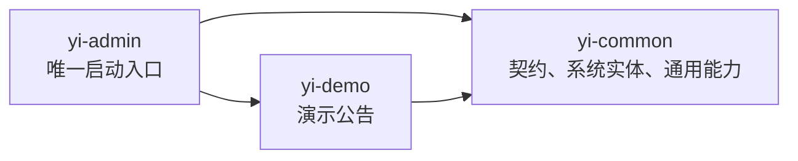
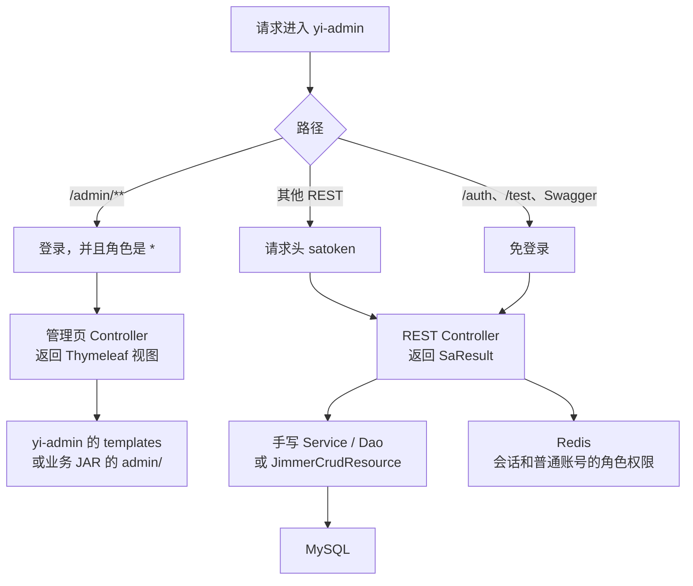
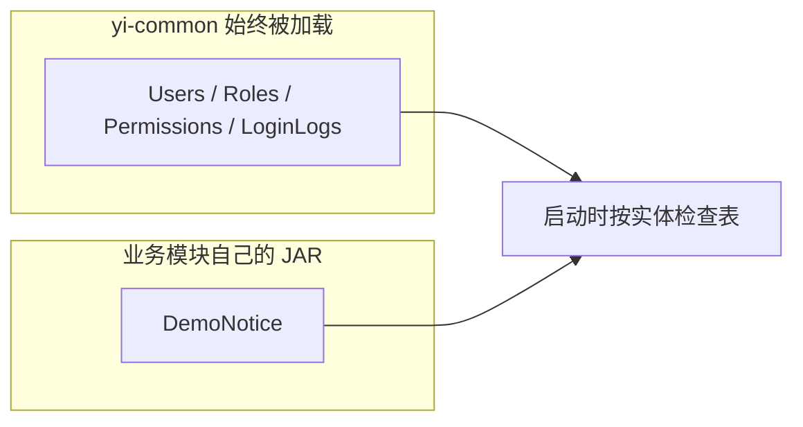

# 架构

这里写模块边界和必须守住的约定。怎么跑起来、有哪些接口，见仓库根目录的 [README.md](../README.md)。管理页和通用 CRUD 的步骤见 [admin-pages.md](admin-pages.md)、[crud.md](crud.md)。

## 模块

业务通过依赖接入，不把页面和实体堆进 `yi-admin`。



| 模块 | 职责 | 能否单独启动 |
|------|------|----------------|
| `yi-admin` | 启动、鉴权、系统管理页面和接口、OpenAPI、收集菜单 | 能 |
| `yi-common` | 系统实体、异常、分页、通用 CRUD、管理页契约 | 不能 |
| `yi-demo` | 一个业务 JAR：实体、接口、管理页模板 | 不能 |

`yi-demo` 依赖 `yi-common`，不依赖 `yi-admin`。菜单契约放在公共库里，就是为了避免业务模块和宿主互相依赖。

父工程登记 Kotlin、Spring Boot、KSP 和 Jimmer 的版本，并把 `spring-boot-starter-web` 交给每个子模块，库模块才能编译 Controller。嵌入式服务器只在应用了 Spring Boot 插件的 `yi-admin` 里运行。Thymeleaf 只放在 `yi-admin`。新增的第三方库写在真正使用它的模块里。

## 一次请求怎么走



启动类 `com.star.YiAdminApplication` 扫描 `com.star`。不在这个前缀下的 Bean 和 Controller 不会进来。

| 层 | 位置 | 做什么 |
|----|------|--------|
| 启动 | `yi-admin` 的 `Application.kt` | 扫描 `com.star` |
| 鉴权 | `SaTokenConfigure`、`StpInterfaceImpl` | 登录校验；后台再要求角色 `*` |
| REST | `*Controller` | 返回 `SaResult`。用户、角色、权限手写；标准资源继承 `JimmerCrudResource` |
| 管理页 | `@Controller` + Thymeleaf | `/admin/**`。侧栏来自 `AdminPageModule` |
| 数据 | Jimmer + MySQL（默认） | 实体接口，`.dto` 生成查看、入参和查询条件。改用 PostgreSQL 时执行 `sql/pgsql.sql` 并改连接 |
| 缓存 | Redis | Sa-Token 会话；普通账号的角色和权限 |

后台 Cookie 和接口 token 是两套会话，设备分别是 `admin-web` 和 `api`。

## 代码放在哪

```text
Star-Yi-Arc/
├── yi-admin/src/main/kotlin/com/star/
│   ├── Application.kt
│   ├── config/                 Jimmer 列名、Sa-Token、启动横幅
│   └── admin/                  系统页面、用户角色权限、登录日志
├── yi-admin/src/main/resources/
│   ├── application.properties  唯一的运行配置
│   ├── templates/              登录页和系统页
│   └── static/
├── yi-common/src/main/kotlin/com/star/
│   ├── model/entity            BaseEntity
│   ├── identity/entity         用户、角色、权限、登录日志
│   ├── admin/web               AdminPageModule
│   ├── common/                 异常、分页、通用 CRUD、Jimmer
│   ├── openapi/
│   └── utils/
└── yi-demo/src/main/
    ├── kotlin/com/star/demo/   公告实体、接口、管理页 Controller
    ├── dto/                    DemoNotice.dto
    └── resources/admin/        公告管理页模板
```

各文件的作用写在 `yi-admin/README.md` 和 `yi-common/README.md`。

系统实体放在 `yi-common`，是因为登录、鉴权和多个模块都要同一套表。可选业务的实体留在自己的模块里。放进 `yi-common` 之后，即使宿主没有使用这个业务，Jimmer 仍会在启动时校验那张表。



`yi-admin` 已经依赖 `yi-demo`，所以 `demo_notice` 必须建好，否则启动失败。以后若某个业务模块默认不加入构建，它的实体就不能放进 `yi-common`。

## 约定

实体是 Jimmer 的 Kotlin 接口。需要审计字段时继承 `BaseEntity`：`createdTime`、`modifiedTime`、`deletedTime`、`deleted`。`deleted` 对应列 `is_deleted`，为 true 时普通查询不会查出这行。未写 `@Column` 的列名是小写加下划线。

DTO 写在模块的 `src/main/dto/*.dto`。KSP 生成查看对象、创建入参、更新入参和查询条件。生成物在 `build/generated`，不要手改。

REST 返回 `SaResult`。可预期的失败抛 `BusinessException`，由 `GlobalExceptionHandler` 收成带业务码的 JSON。

可运行配置只写在 `yi-admin` 的 `application.properties`。库模块不要再放一份同名文件。

建表用手工 SQL，没有 Flyway。默认数据库是 MySQL，脚本是 `sql/mysql.sql`。`sql/pgsql.sql` 提供同一套表，改连接信息和 `jimmer.dialect` 后可以切换。
